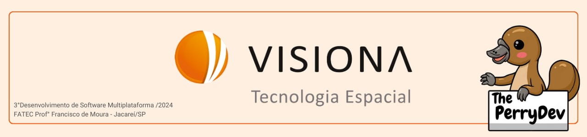

 

  

  

  

<a  href="#clonar">Guia para clonar o repositório</a> |
<a  href="#abrir">Abrindo o repositório satelite</a> |

  

## Guia para clonar o repositório

  

**Clonar Repositório a Partir da Master:**

Para clonar um repositório Git, será necessário usar o seguinte comando no git bash:

**git clone <link-do-repositório>**

No caso de nossa API do projeto satelite:

**git clone https://github.com/ThePerryDev/satelite.git**

**Clonar Branch Específica de um Repositório:**

Para clonar uma branch específica de um Repositório git, utilize o seguinte comando no git bash:

**git clone –b <nome-da-branch>  <link-do-repositório>**

  
  

  

## Abrindo o repositório BikePass

  

 1. Abra as pastas Backend e Frontend separadas cada um em uma janela VsCode, caso ignore essa regra, esteja atento de sempre fazer uso dos terminais integrados do VsCode.

 2. -Para abrir as pastas no VsCode, abra o cmd digitando **cmd** no caminho da pasta na parte superior da página do explorador de arquivos, já dentro da pasta que será aberta, após isso digite no terminal **“code .”**, e isso abrira o VsCode.
 3. Terminal integrado: Caso tenha ignorado a primeira instrução, nunca use comando npm na pasta geral, lembre-se sempre de utilizar o terminal integrado, clicando com o botão direito do mouse na pasta que você estará utilizando no momento e clicando em **“Open in Integrated Terminal”**, e tenha atenção para não fazer uso dos terminais errados.

 4. No terminal de cada uma das pastas, utilize o comando **“npm i”** no terminal para instalar todas as dependências do projeto.

	**npm i**  

 5. Crie o banco de dados bdsatelite, isso pode ser usado através do terminal SQL Shell psql, mantendo todas as opções padrões e fazendo uso da senha “123”, para criar o banco de dados digite:  

	**CREATE DATABASE bdsatelite;**

 6. Após isso, no terminal da pasta backend use o código:
	
	**npm run migration:generate**

	  E

	**npm run migration:run**

  
    Esses códigos têm como função respectivamente criar o comando sql e executar o comando sql.

 1. Em seguida utilize o comando que fara o código ser inicializado e atualizado sempre que houver alterações:

	**npm run dev**

	Caso deseje que ele não seja atualizado automaticamente faça uso do comando:

	**npm run start**

    Isso fara com que o código executado permaneça rodando, parte essa essencial em nosso projeto.

 8. Após isso no terminal da pasta de Frontend, utilize o seguinte comando para inicializar o React e assim puder trabalhar normalmente:

	**npm run start**

